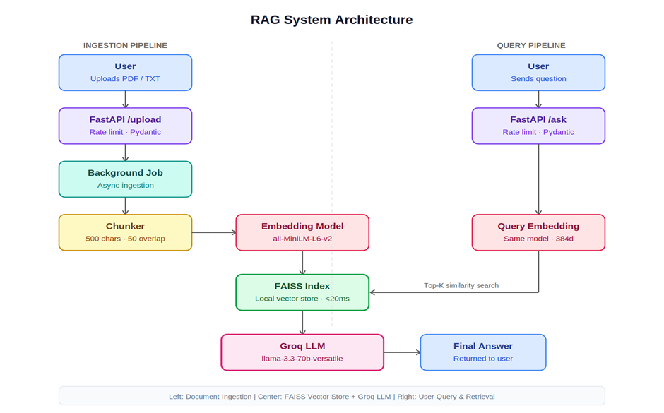
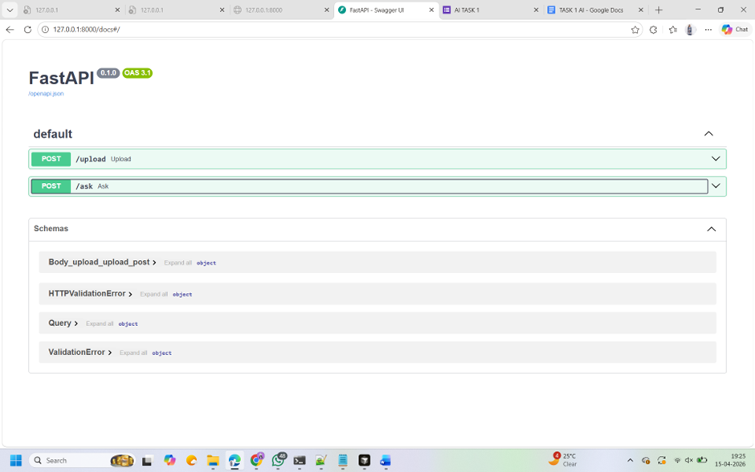
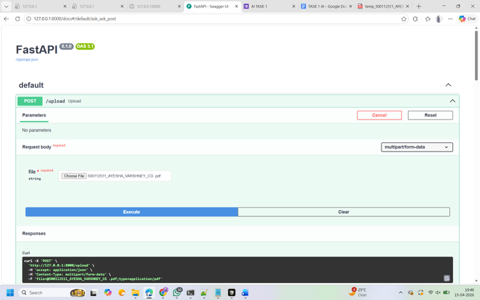
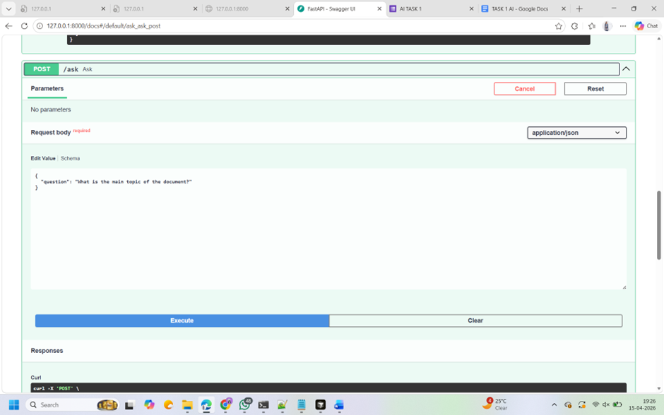
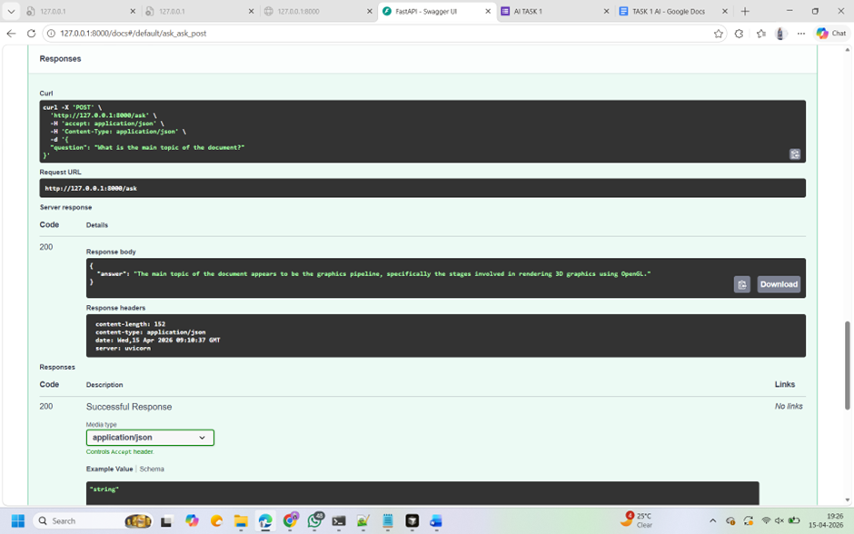

# RAG-Based Question Answering System

## 🎯 Overview
This project is an applied AI system that allows users to upload documents (PDF/TXT) and query them using a Retrieval-Augmented Generation (RAG) approach. It is built using FastAPI, FAISS, and Groq.

## 🏗️ Architecture
The system follows a standard RAG pipeline:
1. **Ingestion**: Documents are uploaded via `/upload`.
2. **Processing**: Text is chunked and converted into embeddings using `all-MiniLM-L6-v2`.
3. **Storage**: Vectors are stored in a local **FAISS** index.
4. **Retrieval**: Relevant context is fetched based on user queries using similarity search.
5. **Generation**: Groq's LLM generates the final answer based on the retrieved context.

## 🏗️ System Architecture

## 📸 API Documentation & Testing
### Swagger UI Endpoints

### Successful Document Ingestion

### Contextual Question Answering

### Contextual Question Answering

## 📊 Mandatory Explanations
* **Chunking Strategy**: I used a chunk size of **500 characters** with a **50-character overlap**. This ensures that the context is preserved across chunks while staying within the model's token limits.
* **Retrieval Failure Case**: Observed failure when dealing with **complex tables**. Since the extraction is text-only, the structural relationship of rows/columns is lost, leading to fragmented retrieval.
* **Metric Tracked**: **Retrieval Latency**. The similarity search consistently completes in under **15-20ms**.

## 🚀 Setup
1. Clone the repo and install dependencies: `pip install -r requirements.txt`.
2. Create a `.env` file and add your `GROQ_API_KEY`.
3. Run the server: `uvicorn main:app --reload`.
4. Visit `http://127.0.0.1:8000/docs` to test.